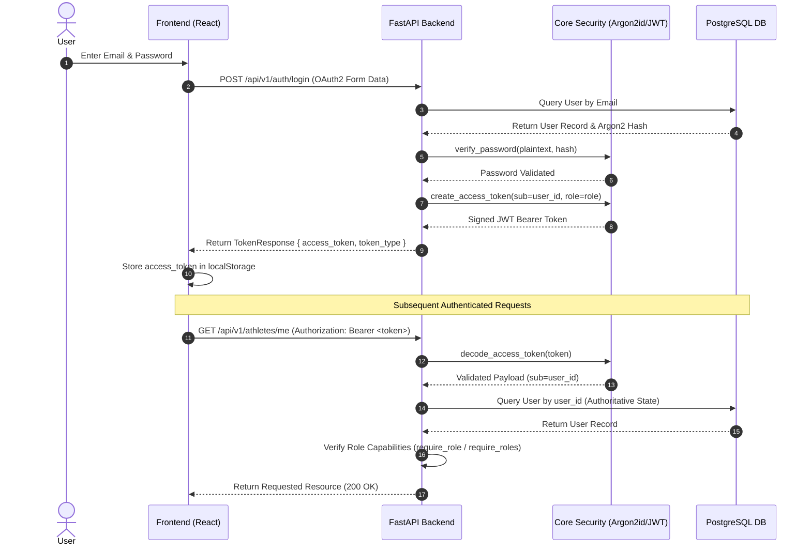
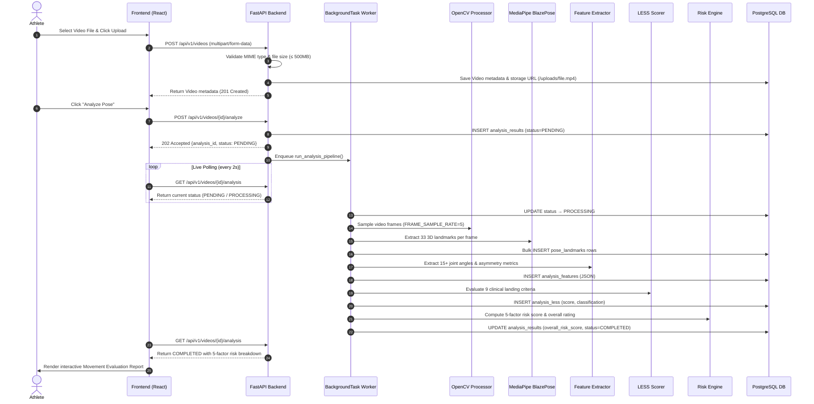

# System Architecture & Technical Specification

This document details the architectural design, component flow, security model, and data management pipelines of the **Sports Injury Risk Detection System**.

---

## 🏗️ High-Level System Architecture

The application follows a decoupled client-server architecture with a Single Page Application (SPA) frontend, a RESTful FastAPI backend, an AI processing pipeline, and a PostgreSQL relational database running in Docker containers.

```mermaid
graph TD
    subgraph Client Layer [Frontend - React SPA]
        A[Browser UI / React] -->|HTTPS Requests| B[Axios HTTP Client]
        B -->|Bearer JWT Header| C[Auth Context & LocalStorage]
        A -->|allowedRoles Check| R[ProtectedRoute & Role Guard]
    end

    subgraph API Layer [Backend - FastAPI]
        D[FastAPI Router] -->|Dependency Injection| E[get_current_user Auth Guard]
        E -->|Role Validation| F[RBAC Enforcement: Athlete/Coach/Physio/Admin]
        D -->|JSON / Multipart Payload| G[Pydantic v2 Schemas]
    end

    subgraph Analytics & AI Pipeline Layer
        D -->|POST /analyze| BG[BackgroundTask Orchestrator]
        BG --> VP[OpenCV VideoProcessor - Frame Sampling]
        VP --> PE[MediaPipe PoseEstimator - 33 3D Landmarks]
        PE --> FE[Biomechanical FeatureExtractor - Kinematics]
        FE --> LESS[LESS Scorer - 9 Clinical Criteria]
        LESS --> RS[RiskScoringService - 5-Factor Risk Engine]
    end

    subgraph Data & Storage Layer [Docker Infrastructure]
        RS --> ORM[SQLAlchemy 2.0 ORM]
        ORM --> DB[(PostgreSQL 16 Database)]
        VP --> FS[/app/uploads Docker Storage Volume]
    end

    B -->|REST Calls| D
```

---

## 🔐 1. Authentication & Security Flow (JWT & RBAC)

The system implements stateless JWT authentication combined with database-authoritative Role-Based Access Control (RBAC).



### Key Security Mechanics:
1. **Password Hashing**: Passwords are saved strictly using the **Argon2id** algorithm (`argon2-cffi`).
2. **User Enumeration Defense**: The login handler executes constant-time hash verifications even when an email address is not found in the database.
3. **Database Authoritative Roles**: Roles (`Athlete`, `Coach`, `Physiotherapist`, `Sports Scientist`, `Administrator`) are re-verified against PostgreSQL on every request via `get_current_user` rather than trusting payload claims blindly.
4. **Forbidden Administrator Registration**: Self-registration for the `Administrator` role is explicitly rejected at the validation layer.

---

## 🛡️ 2. Dual-Layer RBAC Architecture

Security is enforced at two distinct layers:

### A. Backend Authorization (FastAPI Enforcement — True Security)
Every API endpoint validates permissions server-side:
* **Primary Auth Guard**: `get_current_user` extracts JWT `sub` (UUID) and fetches the authoritative `User` from PostgreSQL.
* **Role Dependency Factories**:
  * `require_role(allowed_role)`: Returns HTTP 403 Forbidden if `user.role != allowed_role`.
  * `require_roles(*allowed_roles)`: Returns HTTP 403 Forbidden if `user.role` is not in `allowed_roles`.
* **Resource-Level Authorization**:
  * `/athletes/me`, `POST /videos`: Resolves `athlete_id` strictly from `user.user_id` of the authenticated JWT.
  * `GET /athletes/{id}`: Athlete can only request their own profile; staff roles (`Coach`, `Physio`, `Scientist`, `Admin`) can view any profile.
  * `DELETE /athletes/{id}`: Restricted to `RoleEnum.ADMINISTRATOR`.

### B. Frontend Route & UI Adaptation (React — UX & Navigation)
* **Route Protection (`ProtectedRoute.jsx`)**: Checks `isAuthenticated` and optional `allowedRoles`. If an authenticated user attempts direct URL navigation to an unauthorized route, a clean `Access Restricted` UI is displayed.
* **Role-Aware Sidebar (`Sidebar.jsx`)**: Filters sidebar links dynamically based on `user.role` (e.g., Roster and Assessments shown for Staff roles, Video Upload shown for Athletes).
* **Customized Dashboard (`Dashboard.jsx`)**: Adapts greeting, statistics, and quick-action buttons based on whether the user is an Athlete or Staff.

---

## 📹 3. Video Upload & AI Processing Pipeline

The platform handles video uploads via FastAPI, saving video files to the persistent container storage volume `/app/uploads` and indexing metadata in PostgreSQL.



---

## 💻 Tech Stack Overview

| Layer | Technologies Used |
|---|---|
| **Frontend UI** | React 18, Vite, Lucide React Icons, Vanilla CSS Design System |
| **State & HTTP** | React Context API (`AuthContext`), Axios + Interceptors, React Router v6 |
| **Backend Framework** | Python 3.11+ / 3.14, FastAPI, Pydantic v2, Pydantic Settings |
| **Database & ORM** | PostgreSQL 16, SQLAlchemy 2.0 (ORM & Mapped Types), Alembic Migrations |
| **Security & Auth** | Argon2id (`argon2-cffi`), PyJWT (`python-jose`), FastAPI OAuth2 Bearer |
| **Video Processing** | OpenCV (`opencv-python-headless`) — frame validation, FPS/resolution, frame sampling |
| **Pose Estimation** | MediaPipe BlazePose — 33 spatial landmarks (x, y, z, visibility) per frame |
| **Feature Extraction** | Kinematic Joint Angle Engine (15+ angles, angular velocities, asymmetry) |
| **LESS Evaluation** | Landing Error Scoring System Engine (9 criteria items, classification) |
| **Risk Scoring** | 5-Factor Risk Scoring Engine (`s_bio`, `s_hist`, `s_asym`, `s_load`, `s_fatigue`) |
| **Containerisation** | Docker & Docker Compose (`compose.yaml`) with persistent volumes |

