# Database Architecture & Entity Schema

The **Sports Injury Risk Detection System** uses a PostgreSQL relational database. Database schema and migrations are managed using **SQLAlchemy 2.0 ORM** and **Alembic**.

---

## 🗺️ Entity Relationship Diagram (ERD)

```mermaid
erDiagram
    users ||--o| athletes : "has profile (1:1)"
    users ||--o{ notifications : "receives (1:N)"
    users ||--o{ reports : "generates (1:N)"
    users ||--o{ athletes : "coaches (1:N)"
    athletes ||--o{ videos : "uploads (1:N)"
    athletes ||--o{ injury_history : "records (1:N)"
    athletes ||--o{ performance_records : "tracks (1:N)"
    athletes ||--o{ reports : "subject of (1:N)"
    athletes ||--o{ analysis_results : "evaluated in (1:N)"
    videos ||--o{ analysis_results : "analyzed in (1:N)"
    analysis_results ||--o{ pose_landmarks : "contains (1:N)"
    analysis_results ||--o| analysis_features : "extracts (1:1)"
    analysis_results ||--o| analysis_less : "evaluates (1:1)"
    analysis_results ||--o| injury_predictions : "produces (1:1)"
    injury_predictions ||--o{ recommendations : "triggers (1:N)"

    users {
        uuid user_id PK
        string name "NOT NULL"
        string email "UK, INDEX, NOT NULL"
        text password "NOT NULL"
        user_role_enum role "NOT NULL"
        string phone "NULLABLE"
        text profile_image "NULLABLE"
        boolean is_active "NOT NULL, DEFAULT true"
        boolean is_verified "NOT NULL, DEFAULT false"
        datetime created_at "NOT NULL"
    }

    athletes {
        uuid athlete_id PK
        uuid user_id FK "NOT NULL"
        uuid coach_id FK "NULLABLE"
        string injury_status "DEFAULT Healthy"
        string sport "NULLABLE"
        string position "NULLABLE"
        integer age "NULLABLE"
        float height "NULLABLE"
        float weight "NULLABLE"
        float training_load "NULLABLE"
        float flexibility "NULLABLE"
        float strength "NULLABLE"
        float balance "NULLABLE"
        float endurance "NULLABLE"
        text coach_notes "NULLABLE"
    }

    videos {
        uuid video_id PK
        uuid athlete_id FK "NOT NULL"
        string title "NULLABLE"
        string activity "NULLABLE"
        text video_url "NULLABLE"
        float duration "NULLABLE"
        float fps "NULLABLE"
        string resolution "NULLABLE"
        float quality_score "NULLABLE"
        string processing_status "NULLABLE"
        datetime uploaded_at "NOT NULL"
        bytea file_data "NULLABLE"
        string original_filename "NULLABLE"
        string content_type "NULLABLE"
        bigint file_size "NULLABLE"
    }

    analysis_results {
        uuid analysis_id PK
        uuid video_id FK "NOT NULL"
        uuid athlete_id FK "NOT NULL"
        string status "NOT NULL, DEFAULT PENDING"
        text error_message "NULLABLE"
        float fps "NULLABLE"
        integer frame_count "NULLABLE"
        float duration_seconds "NULLABLE"
        integer width "NULLABLE"
        integer height "NULLABLE"
        integer frames_processed "NULLABLE"
        float knee_valgus "NULLABLE"
        float hip_stability "NULLABLE"
        float trunk_lean "NULLABLE"
        float stride_length "NULLABLE"
        float joint_alignment "NULLABLE"
        float symmetry_score "NULLABLE"
        float fatigue_score "NULLABLE"
        float movement_quality "NULLABLE"
        float overall_risk_score "NULLABLE"
        string risk_level "NULLABLE"
        datetime created_at "NOT NULL"
        datetime completed_at "NULLABLE"
    }

    pose_landmarks {
        uuid landmark_id PK
        uuid analysis_id FK "NOT NULL"
        integer frame_index "NOT NULL"
        float timestamp_ms "NULLABLE"
        integer landmark_index "NOT NULL"
        string landmark_name "NULLABLE"
        float x "NOT NULL"
        float y "NOT NULL"
        float z "NOT NULL"
        float visibility "NULLABLE"
        float presence "NULLABLE"
    }

    analysis_features {
        uuid feature_id PK
        uuid analysis_id FK "NOT NULL, UK"
        string feature_version "NOT NULL, DEFAULT v1"
        json features "NOT NULL"
        datetime created_at "NOT NULL"
    }

    analysis_less {
        uuid less_id PK
        uuid analysis_id FK "NOT NULL, UK"
        integer score "NOT NULL"
        integer max_computable_score "NOT NULL"
        integer computable_items "NULLABLE"
        integer error_items "NULLABLE"
        integer not_computable_items "NULLABLE"
        string classification "NOT NULL"
        string source "NULLABLE"
        string validation_source "NULLABLE"
        string source_version "NULLABLE"
        text disclaimer "NULLABLE"
        json items "NOT NULL"
        datetime created_at "NOT NULL"
    }

    injury_predictions {
        uuid prediction_id PK
        uuid analysis_id FK "NOT NULL"
        float acl_risk "NULLABLE"
        float hamstring_risk "NULLABLE"
        float ankle_risk "NULLABLE"
        float shoulder_risk "NULLABLE"
        float lower_back_risk "NULLABLE"
        float overuse_risk "NULLABLE"
    }

    recommendations {
        uuid recommendation_id PK
        uuid prediction_id FK "NOT NULL"
        text exercise "NULLABLE"
        text mobility "NULLABLE"
        text strengthening "NULLABLE"
        text recovery "NULLABLE"
        text training_modification "NULLABLE"
    }

    injury_history {
        uuid injury_id PK
        uuid athlete_id FK "NOT NULL"
        string injury_type "NULLABLE"
        string body_part "NULLABLE"
        string severity "NULLABLE"
        date injury_date "NULLABLE"
        date recovery_date "NULLABLE"
        text remarks "NULLABLE"
    }

    performance_records {
        uuid record_id PK
        uuid athlete_id FK "NOT NULL"
        string activity "NULLABLE"
        float score "NULLABLE"
        text remarks "NULLABLE"
        datetime recorded_at "NOT NULL"
    }

    notifications {
        uuid notification_id PK
        uuid user_id FK "NOT NULL"
        string title "NULLABLE"
        text message "NULLABLE"
        string notification_type "NULLABLE"
        boolean is_read "NOT NULL, DEFAULT false"
        datetime created_at "NOT NULL"
    }

    reports {
        uuid report_id PK
        uuid athlete_id FK "NOT NULL"
        string report_type "NULLABLE"
        uuid generated_by FK "NOT NULL"
        text file_path "NULLABLE"
        datetime generated_at "NOT NULL"
    }
```

---

## 🗄️ Detailed Table Specifications

### 1. `users` Table
Stores user accounts, credentials, authentication status, and system roles.
- `user_id` (UUID PK): Unique user identifier.
- `name` (VARCHAR, NOT NULL): Full user name.
- `email` (VARCHAR, UNIQUE, INDEX, NOT NULL): User email address.
- `password` (VARCHAR, NOT NULL): Argon2id hashed password string.
- `role` (ENUM, NOT NULL): User role (`Athlete`, `Coach`, `Physiotherapist`, `Sports Scientist`, `Administrator`).
- `phone` (VARCHAR, NULLABLE): Contact phone number.
- `profile_image` (TEXT, NULLABLE): URL/path to profile avatar.
- `is_active` (BOOLEAN, NOT NULL, DEFAULT true): Account activity flag.
- `is_verified` (BOOLEAN, NOT NULL, DEFAULT false): Verification flag.
- `created_at` (TIMESTAMP WITH TIME ZONE, NOT NULL): Account creation timestamp.

### 2. `athletes` Table
Stores physical baselines, athletic metrics, and coaching metadata linked 1:1 to a User.
- `athlete_id` (UUID PK): Unique athlete profile identifier.
- `user_id` (UUID FK -> `users.user_id`, NOT NULL): User reference.
- `coach_id` (UUID FK -> `users.user_id`, NULLABLE): Assigned coach reference.
- `injury_status` (VARCHAR, DEFAULT 'Healthy'): Current availability status ('Healthy', 'Injured', 'Reassessment').
- `sport` (VARCHAR, NULLABLE): Primary sport.
- `position` (VARCHAR, NULLABLE): Playing position.
- `age` (INTEGER, NULLABLE): Age in years.
- `height` (FLOAT, NULLABLE): Height in centimeters.
- `weight` (FLOAT, NULLABLE): Weight in kilograms.
- `training_load` (FLOAT, NULLABLE): Current weekly training load index.
- `flexibility`, `strength`, `balance`, `endurance` (FLOAT, NULLABLE): Assessment ratings.
- `coach_notes` (TEXT, NULLABLE): Staff notes.

### 3. `videos` Table
Stores uploaded movement video metadata and storage file paths.
- `video_id` (UUID PK): Video identifier.
- `athlete_id` (UUID FK -> `athletes.athlete_id`, NOT NULL): Athlete reference.
- `title` (VARCHAR, NULLABLE): Custom video assessment title.
- `activity` (VARCHAR, NULLABLE): Specific movement exercise.
- `video_url` (TEXT, NULLABLE): Relative URL path served via `/uploads/` static files mount.
- `duration`, `fps` (FLOAT, NULLABLE): Video duration and frame rate.
- `resolution`, `quality_score` (VARCHAR/FLOAT, NULLABLE): Spatial resolution and video quality index.
- `processing_status` (VARCHAR, NULLABLE): Upload processing status ('uploaded', 'analyzing', 'COMPLETED').
- `uploaded_at` (TIMESTAMP WITH TIME ZONE, NOT NULL): Upload timestamp.
- `file_data` (BYTEA, NULLABLE): Optional raw binary storage column.
- `original_filename` (VARCHAR, NULLABLE): Original file name.
- `content_type` (VARCHAR, NULLABLE): MIME type.
- `file_size` (BIGINT, NULLABLE): File size in bytes.

### 4. `analysis_results` Table
Tracks processing lifecycle and overall biomechanical risk scoring results.
- `analysis_id` (UUID PK): Analysis record identifier.
- `video_id` (UUID FK -> `videos.video_id`, NOT NULL): Video reference.
- `athlete_id` (UUID FK -> `athletes.athlete_id`, NOT NULL): Athlete reference.
- `status` (VARCHAR, NOT NULL, DEFAULT 'PENDING'): Lifecycle state (`PENDING`, `PROCESSING`, `COMPLETED`, `FAILED`).
- `error_message` (TEXT, NULLABLE): Error diagnostic if failed.
- `fps`, `frame_count`, `duration_seconds`, `width`, `height`, `frames_processed`: Video processing metrics.
- `knee_valgus`, `hip_stability`, `trunk_lean`, `stride_length`, `joint_alignment`, `symmetry_score`, `fatigue_score`, `movement_quality`: Kinematic summary scores.
- `overall_risk_score` (FLOAT, NULLABLE): Composite risk score (0–100).
- `risk_level` (VARCHAR, NULLABLE): Risk level ('LOW', 'MODERATE', 'HIGH').
- `created_at` (TIMESTAMP WITH TIME ZONE, NOT NULL): Creation timestamp.
- `completed_at` (TIMESTAMP WITH TIME ZONE, NULLABLE): Pipeline completion timestamp.

### 5. `pose_landmarks` Table
Stores 3D landmark spatial coordinates extracted per sampled frame by MediaPipe.
- `landmark_id` (UUID PK): Landmark record identifier.
- `analysis_id` (UUID FK -> `analysis_results.analysis_id`, NOT NULL): Linked analysis reference.
- `frame_index` (INTEGER, NOT NULL): 0-indexed frame number.
- `timestamp_ms` (FLOAT, NULLABLE): Timestamp in milliseconds.
- `landmark_index` (INTEGER, NOT NULL): MediaPipe joint index (0–32).
- `landmark_name` (VARCHAR, NULLABLE): Joint name (e.g., 'LEFT_KNEE').
- `x`, `y`, `z` (FLOAT, NOT NULL): Normalized 3D spatial coordinates.
- `visibility`, `presence` (FLOAT, NULLABLE): Detection confidence scores.

### 6. `analysis_features` Table
Stores extracted kinematic joint angle vectors and asymmetry metrics as structured JSON.
- `feature_id` (UUID PK): Feature record identifier.
- `analysis_id` (UUID FK -> `analysis_results.analysis_id`, NOT NULL, UNIQUE): Analysis reference.
- `feature_version` (VARCHAR, NOT NULL, DEFAULT 'v1'): Schema version string.
- `features` (JSON/JSONB, NOT NULL): Kinematic dictionary containing 15+ joint angle time series, angular velocities, valgus indices, and asymmetry percentages.
- `created_at` (TIMESTAMP WITH TIME ZONE, NOT NULL): Creation timestamp.

### 7. `analysis_less` Table
Stores Landing Error Scoring System (LESS) clinical evaluations.
- `less_id` (UUID PK): LESS record identifier.
- `analysis_id` (UUID FK -> `analysis_results.analysis_id`, NOT NULL, UNIQUE): Analysis reference.
- `score` (INTEGER, NOT NULL): Total detected error score.
- `max_computable_score` (INTEGER, NOT NULL): Maximum computable items for the evaluation.
- `computable_items`, `error_items`, `not_computable_items` (INTEGER, NULLABLE): Item counters.
- `classification` (VARCHAR, NOT NULL): Technique quality ('EXCELLENT', 'GOOD', 'MODERATE', 'POOR').
- `source`, `validation_source`, `source_version`, `disclaimer` (TEXT, NULLABLE): Clinical reference metadata.
- `items` (JSON/JSONB, NOT NULL): Detailed JSON list of 9 criteria items (status, score, measured value, threshold, reference).
- `created_at` (TIMESTAMP WITH TIME ZONE, NOT NULL): Creation timestamp.

---

## 📜 Migration Log History

1. `2026_08_15_1105-5d34925c67e8_initial_schema_mentor_aligned_uuid.py`: Initial baseline schema creation (`users`, `athletes`, `videos`, `analysis_results`, `injury_predictions`, `recommendations`, `injury_history`, `performance_records`, `notifications`, `reports`).
2. `2026_08_15_1111-db5f18369348_change_role_to_native_pg_enum.py`: Converts role column to PostgreSQL native enum type.
3. `2026_08_18_0022-20ddf52c0e83_align_database_with_injury_detection_.py`: Schema alignment and index additions.
4. `2026_08_19_2338-507b90721148_add_binary_storage_cols_to_videos.py`: Adds `file_data`, `original_filename`, `content_type`, and `file_size` columns to `videos`.
5. `2026_08_27_1419-a1b2c3d4e5f6_add_pose_landmarks_and_analysis_status.py`: Adds `pose_landmarks` table and status fields to `analysis_results`.
6. `2026_08_27_1525-b2c3d4e5f6a7_add_analysis_features_table.py`: Adds `analysis_features` JSON table.
7. `2026_09_02_1900-c3d4e5f6a7b8_add_analysis_less_results_table.py`: Adds `analysis_less` table.
8. `2026_09_11_1430-d4e5f6a7b8c9_add_coach_id_and_injury_status_to_athletes.py`: Adds `coach_id` foreign key and `injury_status` column to `athletes`.
9. `2026_09_11_1710-e5f6a7b8c9d0_add_title_to_videos.py`: Adds `title` column to `videos`.

