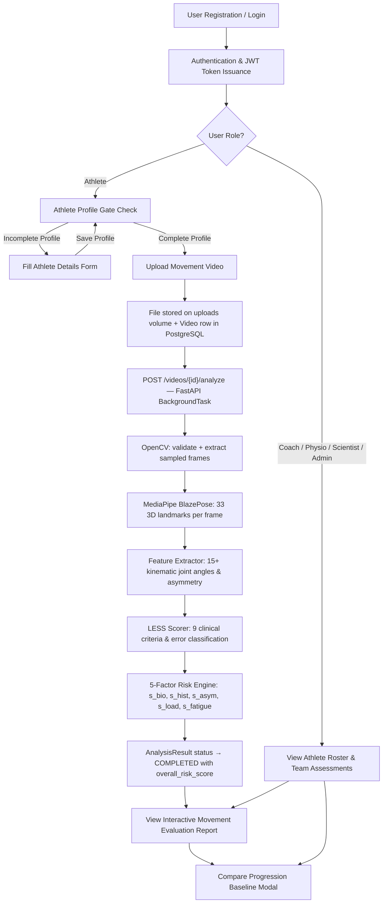
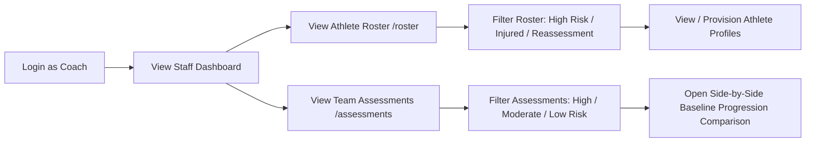
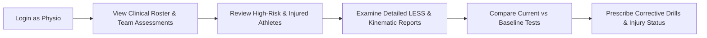
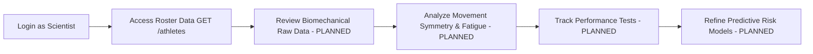

# System Workflows & Role-Based Journeys

This document details the complete end-to-end user workflows and role-specific journeys in the **Sports Injury Risk Detection System**.

---

## 🔄 High-Level System Workflow Overview



---

## 👥 Role-Specific Workflows

Below are the operational workflows for each of the five system roles defined in the RBAC matrix (`Athlete`, `Coach`, `Physiotherapist`, `Sports Scientist`, `Administrator`).

---

### 1. Athlete Workflow

The Athlete workflow focuses on physical baseline management, submitting movement videos for automated analysis, and reviewing evaluation reports.

```mermaid
flowchart LR
    A[Register / Login] --> B[View Dashboard & Profile]
    B --> C{Profile Complete?}
    C -- No --> D[Fill Sport, Position, Age, H, W]
    D --> E[PUT /athletes/me]
    E --> C
    C -- Yes --> F[Access Video Analysis /analysis]
    F --> G[Select Video File max 500MB]
    G --> H[POST /videos — Upload file]
    H --> I[Analyze Button appears in UI]
    I --> J[POST /videos/{id}/analyze]
    J --> K["BackgroundTask Pipeline"]
    K --> L["OpenCV + MediaPipe + Kinematics + LESS + Risk Engine"]
    L --> M[Frontend polls status — PENDING→PROCESSING→COMPLETED]
    M --> N[View Full Report: Risk Score, LESS, Kinematics, Recommendations]
```

#### Step-by-Step Breakdown:
1. **Registration & Authentication** (`IMPLEMENTED`)
   * Self-register via `/register` selecting the `Athlete` role, or log in via `/login`.
   * Receive a signed JWT token stored in client `localStorage`.
2. **Profile Completion & Verification** (`IMPLEMENTED`)
   * Navigate to `/profile`. The system fetches profile state via `GET /api/v1/athletes/me`.
   * If any required physical parameters are missing, status is marked `⚠ Incomplete`.
   * Submit physical details via `PUT /api/v1/athletes/me`. `athlete_id` and `user_id` are derived server-side.
3. **Profile-Gated Video Upload** (`IMPLEMENTED`)
   * Navigate to `/analysis`. If profile is incomplete, a warning banner redirects the user to `/profile`.
   * Upload video file (MP4, MOV, AVI, WebM — max 500 MB) via `POST /api/v1/videos`.
   * File saved to persistent container volume (`/app/uploads`) with PostgreSQL metadata record.
4. **AI Pose Estimation & Risk Analysis Pipeline** (`IMPLEMENTED`)
   * Click **Analyze Pose**. `POST /api/v1/videos/{video_id}/analyze` queues background processing.
   * Frontend polls `GET /api/v1/videos/{video_id}/analysis` every 2 seconds (`PENDING → PROCESSING → COMPLETED`).
   * **OpenCV** extracts sampled frames (`FRAME_SAMPLE_RATE=5`).
   * **MediaPipe BlazePose** extracts 33 3D body landmarks per frame.
   * **Feature Extractor** computes 15+ joint angles, angular velocities, and bilateral asymmetries.
   * **LESS Scorer** evaluates 9 clinical landing criteria and assigns error classification.
   * **Risk Scoring Engine** computes 5-factor scores (`s_bio`, `s_hist`, `s_asym`, `s_load`, `s_fatigue`) and overall 0–100 risk score.
5. **Interactive Movement Evaluation Report** (`IMPLEMENTED`)
   * View full evaluation report featuring overall risk gauge, 5-factor breakdown, LESS checklist, joint kinematics, pose overlay player, and corrective recommendations.

---

### 2. Coach Workflow

The Coach workflow centers on team roster monitoring, squad management, and movement evaluation progression tracking.



#### Step-by-Step Breakdown:
1. **Authentication & Access Control** (`IMPLEMENTED`)
   * Log in via `/login` with a `Coach` account. Staff navigation and endpoints unlocked via RBAC dependencies.
2. **Squad Roster Management** (`IMPLEMENTED`)
   * Access athlete roster on `/roster` (`GET /api/v1/athletes`).
   * Filter squad members by group filters (`High Risk`, `Injured`, `Reassessment`) or search by name, sport, position.
   * Provision new athlete profiles (`POST /api/v1/athletes`) or update physical baselines (`PATCH /api/v1/athletes/{id}`).
3. **Team Assessment Review** (`IMPLEMENTED`)
   * Access team assessment evaluations on `/assessments` (`GET /api/v1/videos/assessments`).
   * Filter by Risk Level (`All`, `High Risk`, `Moderate Risk`, `Low Risk`).
   * View full movement analysis report for any athlete.
4. **Baseline Progression Comparison** (`IMPLEMENTED`)
   * Click **Compare** on any assessment to open the progression modal.
   * System automatically matches the athlete's immediately preceding completed evaluation from database history.
   * Displays directional risk deltas (`Worsened` / `Improved` / `Unchanged`), score differences, and key metrics comparison (Risk Score, LESS Score, Biomechanical Risk, Asymmetry, Fatigue).

---

### 3. Physiotherapist Workflow

The Physiotherapist workflow is tailored toward clinical movement evaluation, injury status tracking, and technique error review.



#### Step-by-Step Breakdown:
1. **Authentication** (`IMPLEMENTED`)
   * Log in via `/login` as a `Physiotherapist`. Authorized for staff endpoints.
2. **Clinical Movement Evaluation** (`IMPLEMENTED`)
   * Review athlete evaluation reports (`/analysis/:videoId`) with 5-factor risk score breakdown and LESS criteria checklist.
3. **Bilateral Asymmetry & Joint Kinematics Inspection** (`IMPLEMENTED`)
   * Inspect extracted joint angles, valgus index, and side-to-side asymmetry percentages.
4. **Progression & Recovery Tracking** (`IMPLEMENTED`)
   * Use assessment comparison modal (`/assessments`) to evaluate biomechanical recovery between initial test and post-rehab re-evaluation.
5. **Injury History & Medical Tracking** (`PLANNED`)
   * Review past injury records from the `injury_history` table (body part, severity, injury date, recovery date, clinical remarks).
6. **Biomechanical Kinematic Audit** (`PLANNED`)
   * Audit detailed frame-by-frame joint angle breakdowns (e.g., knee flexion angle at landing, trunk tilt, hip drop).
7. **Rehabilitation & Mobility Prescription** (`PLANNED`)
   * Review system-generated recommendations and prescribe customized physical therapy routines, mobility protocols, and recovery plans stored in `recommendations`.
8. **Explicit Patient Assignment Mapping** (`PLANNED`)
   * Direct Physiotherapist-to-patient assignment scoping is marked as planned until explicit assignment junction tables are introduced.

---

### 4. Sports Scientist Workflow

The Sports Scientist workflow focuses on aggregate movement analytics, performance testing metrics, and machine learning model validation.



#### Step-by-Step Breakdown:
1. **Authentication** (`IMPLEMENTED`)
   * Log in via `/login` with `Sports Scientist` credentials. Authorized for `ATHLETE_VIEW_ROLES`.
2. **Roster Data Inspection** (`IMPLEMENTED`)
   * Browse registered athlete records via `/athletes` (`GET /api/v1/athletes`).
3. **Biomechanical Data Analysis** (`PLANNED`)
   * Analyze spatial-temporal biomechanical parameters stored in `analysis_results` (knee valgus, hip stability, trunk lean, stride length, symmetry score, fatigue score).
4. **Performance Record Evaluation** (`PLANNED`)
   * Track historical physical test scores from `performance_records` (jump height, sprint speed, agility times) against movement quality scores.
5. **Risk Model Validation** (`PLANNED`)
   * Evaluate predictive accuracy of `injury_predictions` models against real-world athlete outcome data to refine algorithms.

---

### 5. Administrator Workflow

The Administrator workflow covers platform security enforcement, account management, and system infrastructure monitoring.

```mermaid
flowchart LR
    A[Login as Admin] --> B[System Infrastructure Health /health]
    B --> C[Manage Users & Roles - PLANNED UI / IMPLEMENTED API]
    C --> D[Delete / Archive Profiles DELETE /athletes/{id}]
    D --> E[Generate System Reports - PLANNED]
```

#### Step-by-Step Breakdown:
1. **Authentication & Security Boundary** (`IMPLEMENTED`)
   * Authenticate with provisioned `Administrator` credentials. (Note: Self-registration as Administrator is blocked at `/auth/register`).
2. **Infrastructure Health Monitoring** (`IMPLEMENTED`)
   * Monitor application status and PostgreSQL database connection liveliness via `/health` and `/`.
3. **Athlete Profile Deletion & Management** (`IMPLEMENTED`)
   * Execute administrative deletion of athlete records via `DELETE /api/v1/athletes/{athlete_id}` (`require_roles(Administrator)`).
   * Provision or override any athlete profile via `POST /api/v1/athletes` or `PATCH /api/v1/athletes/{id}`.
4. **User & Role Administration UI** (`PLANNED`)
   * Admin dashboard for activating/deactivating user accounts (`user.is_active`) and verifying roles.
5. **System-Wide Reporting & PDF Audits** (`PLANNED`)
   * Generate comprehensive compliance, usage, and analytical summary reports stored in `reports`.

---

## 📊 Summary Feature Matrix Across Roles

| Feature / Action | Athlete | Coach | Physiotherapist | Sports Scientist | Administrator | Status |
|---|:---:|:---:|:---:|:---:|:---:|---|
| Self-Registration | ✅ | ✅ | ✅ | ✅ | ❌ (Blocked) | `IMPLEMENTED` |
| View Own Profile | ✅ | ✅ | ✅ | ✅ | ✅ | `IMPLEMENTED` |
| Upsert Own Athlete Profile (`/me`) | ✅ | ❌ | ❌ | ❌ | ❌ | `IMPLEMENTED` |
| View All Athletes Roster | ❌ | ✅ | ✅ | ✅ | ✅ | `IMPLEMENTED` |
| Manage Any Athlete Profile | ❌ | ✅ | ✅ | ❌ | ✅ | `IMPLEMENTED` |
| Delete Athlete Profile | ❌ | ❌ | ❌ | ❌ | ✅ | `IMPLEMENTED` |
| Upload Video Binary (`POST /videos` BYTEA) | ✅ | ❌ | ❌ | ❌ | ❌ | `IMPLEMENTED` |
| Profile-Gated Video Upload UI | ✅ | ❌ | ❌ | ❌ | ❌ | `IMPLEMENTED` |
| 5-Factor Movement Risk Report | ✅ | ✅ | ✅ | ✅ | ✅ | `IMPLEMENTED` |
| LESS 17-Item Protocol Evaluation | ✅ | ✅ | ✅ | ✅ | ✅ | `IMPLEMENTED` |
| Side-by-Side Baseline Comparison Modal | ❌ | ✅ | ✅ | ✅ | ✅ | `IMPLEMENTED` |
| Pose Keypoint Overlay Video Canvas | 🔮 | 🔮 | 🔮 | 🔮 | 🔮 | `PLANNED` |
| Prescribe Rehab & Recovery Plans | ❌ | ❌ | 🔮 | ❌ | ❌ | `PLANNED` |
| Advanced Biomechanical Analytics | ❌ | ❌ | ❌ | 🔮 | 🔮 | `PLANNED` |
| PDF Report Generation | 🔮 | 🔮 | 🔮 | 🔮 | 🔮 | `PLANNED` |
